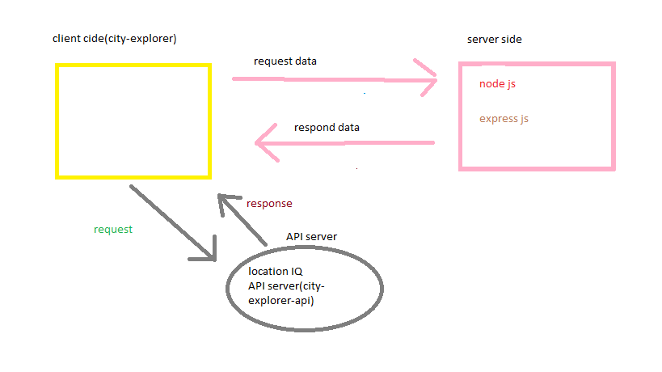

# city-explorer-api
## Overview 🤓
- *API server, which will provide data for the City Explorer front-end application*
- *users will get to see not only the map, but also interesting information about the area*

## Resources
- [Node JS Docs](https://nodejs.org/en/)
- [NPM JS Docs](https://docs.npmjs.com/)
- [Express JS Docs](http://expressjs.com/en/4x/api.html)
- [dotenv Docs](https://www.npmjs.com/package/dotenv)

# Project Name:city-explorer-api 

**Author**: bushra aljafari
**Version**: 1.0.0 (increment the patch/fix version number if you make more commits past your first submission)

## Overview 🤓
- *API server, which will provide data for the City Explorer front-end application*
- *users will get to see not only the map, but also interesting information about the area*

## Getting Started
<!-- What are the steps that a user must take in order to build this app on their own machine and get it running? -->

## Architecture
<!-- Provide a detailed description of the application design. What technologies (languages, libraries, etc) you're using, and any other relevant design information. -->
node.js
express.js

## Change Log
<!-- Use this area to document the iterative changes made to your application as each feature is successfully implemented. Use time stamps. Here's an example:

01-01-2001 4:59pm - Application now has a fully-functional express server, with a GET route for the location resource. -->

## Credit and Collaborations
<!-- Give credit (and a link) to other people or resources that helped you build this application. -->

## Time Estimates

1. Name of feature: Set up your server repository.

2. Estimate of time needed to complete: _20____

3. Start time: __5:10___

4. Finish time: _5:51____

5. Actual time needed to complete: ___40__

1. Name of feature:Weather (placeholder)

2. Estimate of time needed to complete: _1 hour____

3. Start time: 6_____

4. Finish time: __8:50___

5. Actual time needed to complete: ___2:50 houre__

1. Name of feature:Errors 

2. Estimate of time needed to complete: _10 min____

3. Start time: 8:50_____

4. Finish time: __9:30___

5. Actual time needed to complete: __40 min__
